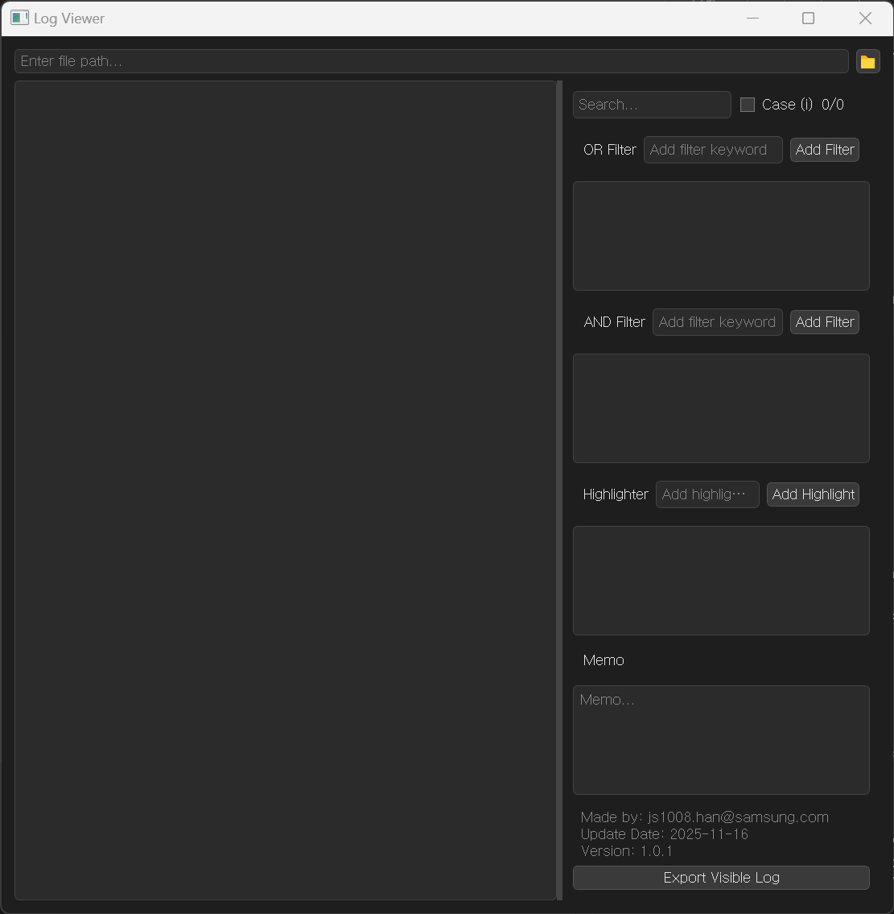

## Log Viewer 


- Available for Windows and Ubuntu
- This viewer can open following files
  - txt, py, zip, tar, gz

<div align="center">

</div>

### How to Build
- Simple Installation
  - The installation method is the same for both Windows and Ubuntu.
    ``` bash
    pip install pyinstaller pyqt5
    pyinstaller --onefile --windowed log_viewer.py
    ``` 
- Low File Size Installation
  - Download latest [UPX](https://github.com/upx/upx/releases) file
    - Windows: upx-x.x.x-win64.zip
    - Ubuntu: upx-x.x.x-amd64_linux.tar.xz
    ``` bash
    pip install pyinstaller pyqt5
    pyinstaller --onefile --windowed --upx-dir=./upx-5.0.2-win64/ --name=log_viewer log_viewer.py
    ```
- C++ Installation
  - Only tested on Windows 11.
    ``` bash
    pip install nuitka pyqt5
    nuitka --onefile --windows-console-mode=disable --lto=yes --disable-plugin=tk-inter --python-flag=no_asserts --remove-output --plugin-enable=pyqt5 --output-dir=output --windows-icon-from-ico=figure/logo.ico --windows-file-version="1.0.1" --output-filename=LogViewer.exe log_viewer.py
    ```

### How to Run
- Run
  - Window
    ``` bash
    .\dist\log_viewer.exe
    ``` 
  - Ubuntu
    ``` bash
    ./log_viewer
    ``` 
